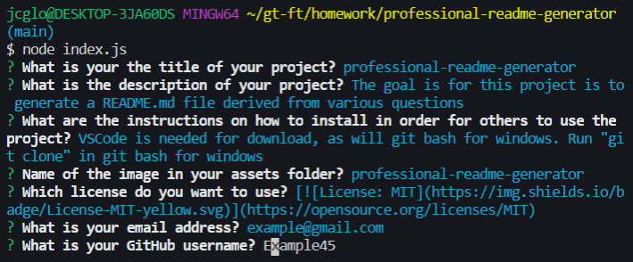

# professional-readme-generator

## Description

The goal is for this project is to generate a README.md file derived from various questions

## Table of Contents

- [Installation](#installation) 
- [Usage](#usage) 
- [Credits](#credits) 
- [License](#license)

## Installation

VSCode is needed for download, as will git bash for windows. Run "git clone" in git bash for windows

## Usage

 

## Credits

The following people helped contribute to the project: 

## License

## Questions
GitHub Repository: [Example45](https://github.com/Example45/)

You can reach me at the following email address: example@gmail.com

    